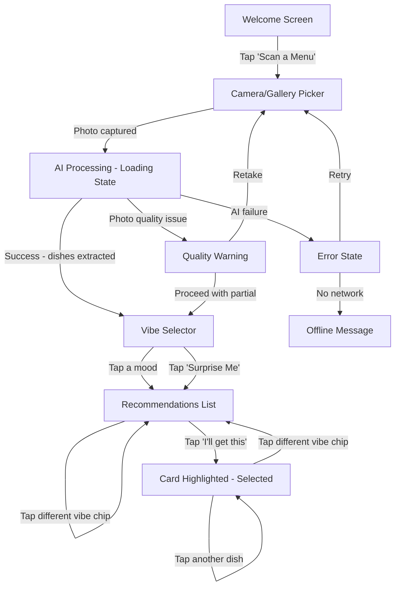
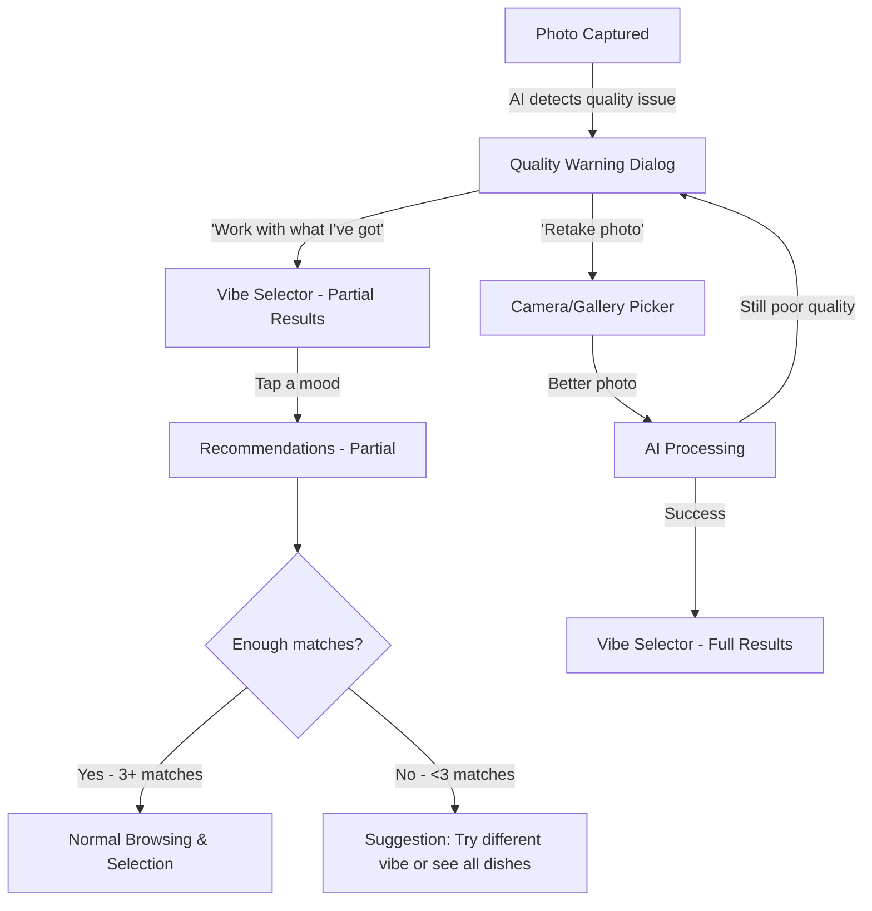

# UX Design Specification - Cravr

**Author:** Kismet Team
**Date:** 2026-03-04

---

## Executive Summary

### Project Vision

Cravr eliminates dining decision fatigue with flavor-profile-first menu intelligence. Users snap a restaurant menu photo, select a mood, and receive AI-ranked dish recommendations based on taste dimensions — transforming opaque menu lists into confident, personalized decisions in under 2 minutes.

### Target Users

**Primary persona: Marco** — 28-year-old office worker in Makati, limited lunch break, frequently faces unfamiliar restaurant menus and defaults to safe choices. Smartphone-native, comfortable with mobile web. Uses the app in-restaurant, at the table, menu in hand, possibly with time pressure.

**Broader audience:** Anyone eating at restaurants who experiences choice paralysis when faced with unfamiliar menus — from solo diners to groups trying to coordinate orders.

**Device context:** Mobile-first (375px–430px viewport). Android Chrome primary, iOS Safari secondary. Camera/photo access required.

### Key Design Challenges

1. **Speed-to-value under pressure** — The full flow (snap → vibe → pick) must complete in under 2 minutes in a real restaurant setting. Any friction point risks abandonment to "just asking the waiter."
2. **AI trust and transparency** — Flavor profiles are AI-generated for dishes the user has never tried. The UI must build confidence through clear presentation without overwhelming data.
3. **Information density on small screens** — Recommendation cards carry 7+ data points (name, match score, flavor tags, price, calories, dietary info, description) on a ~375px mobile viewport.
4. **Graceful degradation** — Real-world menu photos are often blurry, glare-affected, or poorly lit. Partial extraction must still deliver useful results with clear confidence indicators.

### Design Opportunities

1. **Mood-to-food interaction pattern** — The vibe selector (Comfort Food, Adventurous, Impress a Date, etc.) is Cravr's signature UX moment, borrowing from music streaming mood playlists. This is where brand personality and delight live.
2. **Flavor visualization language** — No existing food app visualizes how dishes taste. The flavor profile display is an opportunity to create a distinctive, ownable visual language for taste dimensions.
3. **The confidence moment** — The "I'll get this" action is the emotional payoff of the entire flow. Designing this moment to feel decisive and satisfying creates the word-of-mouth hook.

## Core User Experience

### Defining Experience

Cravr's core experience is a single linear flow: **Snap → Vibe → Reveal → Pick**. The user photographs a menu, selects a mood, and receives AI-ranked dish recommendations with flavor profiles. The entire interaction is designed to complete in under 2 minutes — faster than asking a waiter for suggestions.

The defining moment is the **recommendation card reveal** — when abstract menu text transforms into visual flavor intelligence with match scores. This is the "aha" that makes users say "I didn't know this dish was exactly what I wanted." Everything in the UX exists to deliver this moment as quickly and clearly as possible.

### Platform Strategy

- **Platform:** Mobile-first PWA accessed via URL or QR code — no app store installation
- **Input:** Touch-based interaction on 375px–430px viewport
- **Camera:** File input with capture attribute (photo snap or gallery upload)
- **Network:** Core flow requires connectivity (AI processing is server-side)
- **Offline:** Service worker caches app shell; graceful offline message for core features
- **Browser targets:** Chrome Android (primary), Safari iOS (primary), Chrome Desktop (demo only)

### Effortless Interactions

- **Menu capture** — One tap to camera, one snap, done. No cropping, no alignment guides, no multi-photo stitching. The AI handles imperfect input.
- **Vibe selection** — Single tap on a mood card. No configuration, no sliders, no multi-step filtering. One tap = personalized results.
- **Recommendation browsing** — Cards appear ready to read. No loading spinners between cards, no pagination, no "load more." Scroll and compare naturally.
- **Decision confirmation** — "I'll get this" is a single tap. No cart, no checkout, no account creation. The app's job is done when the user knows what to order.

**The critical friction point: AI processing wait time.** The gap between menu capture and recommendation reveal is the highest-risk moment for abandonment. This wait (potentially 5-10 seconds) must be actively designed — not just tolerated. The loading experience needs to feel like anticipation, not delay.

### Critical Success Moments

1. **The Vibe Tap** (make-or-break) — The mood selector is Cravr's signature interaction and brand differentiator. If this moment feels generic, utilitarian, or confusing, the product loses its identity. It must feel expressive, fun, and immediately intuitive — zero onboarding required.

2. **The Reveal** (success moment) — Recommendation cards appearing with flavor profiles, match scores, and taste tags. This is when the user realizes "this app understands what I want to eat better than I do." First-time user success happens here.

3. **The Pick** (accomplishment moment) — Tapping "I'll get this" should feel decisive and satisfying — a micro-celebration. The user walked in uncertain and is now ordering with confidence.

4. **The Wait** (failure risk) — If AI processing feels slow, broken, or boring, users close the app and ask the waiter. This moment must be transformed from dead time into engaged anticipation.

### Experience Principles

1. **One tap, one outcome** — Every screen has one primary action. No multi-step configuration, no settings panels, no decision trees. Tap and move forward.

2. **Anticipation over waiting** — The AI processing gap is a design opportunity, not a technical limitation. Use it to build excitement for the reveal.

3. **Flavor is the interface** — Taste dimensions (savory, spicy, sweet, umami, rich) are the primary visual language, not dish names or restaurant ratings. Flavor profiles are what users see first and remember most.

4. **Confidence through clarity** — Every data point on a recommendation card earns its space by helping the user decide. Match score = "how well does this fit my mood." Flavor tags = "what does it taste like." Price and calories = "practical constraints." Nothing decorative.

## Desired Emotional Response

### Primary Emotional Goals

- **Empowered confidence** — The dominant feeling throughout the experience. Users should feel like they have insider knowledge about every dish on the menu. Cravr replaces "I guess I'll try this" with "I know this is what I want."
- **Magic and wonder** — The feeling that triggers word-of-mouth. When the AI reveals flavor profiles for dishes the user has never tried, it should feel like the app read their mind. "How did it know that's exactly what I was craving?"
- **Excited discovery** — After picking a dish, users should feel anticipation — not relief. The shift from "I hope this is good" to "I can't wait to try this" is the emotional transformation Cravr delivers.

### Emotional Journey Mapping

| Stage | Desired Emotion | Risk Emotion | Design Response |
|-------|----------------|--------------|-----------------|
| **Welcome / First Open** | Curiosity — "this looks interesting" | Confusion — "what is this?" | Clear value prop, immediate CTA, zero onboarding |
| **Menu Capture** | Ease — "that was simple" | Frustration — "it's not working" | One-tap camera, accept imperfect photos, instant feedback |
| **AI Processing Wait** | Anticipation — "what will it find?" | Impatience — "this is taking too long" | Engaging loading experience that builds excitement |
| **Vibe Selection** | Playfulness — "this is fun" | Decision fatigue — "which one do I pick?" | Expressive mood cards, no wrong answer, single tap |
| **Recommendation Reveal** | Wonder — "how did it know?" | Skepticism — "is this accurate?" | Confident presentation, flavor visualization, high match scores |
| **Browsing Cards** | Discovery — "I never would have tried this" | Overwhelm — "too much information" | Clean card hierarchy, scannable layout, progressive detail |
| **"I'll Get This" Tap** | Excited confidence — "I can't wait to try this" | Second-guessing — "should I pick something else?" | Decisive interaction, micro-celebration, no undo pressure |
| **Error / Partial Results** | Reassurance — "it's still useful" | Frustration — "it's broken" | Friendly tone, actionable options, partial results still valuable |

### Micro-Emotions

**Prioritized emotional states for Cravr:**

- **Confidence over confusion** — Every screen communicates clearly what to do and what just happened. No ambiguity.
- **Excitement over anxiety** — AI results are presented as discoveries to explore, not judgments to evaluate.
- **Delight over mere satisfaction** — The flavor profile reveal should produce a small "wow," not just "ok, useful."
- **Trust over skepticism** — Match scores and flavor tags are presented with conviction. No hedging language ("might be," "possibly"). The AI is confident so the user can be too.

**Emotions to actively prevent:**

- **Impatience** — The #1 emotional risk. Every second of AI processing wait must be designed, not defaulted. Dead screens with spinners create impatience.
- **Frustration** — Camera failures, unclear errors, or "no results" screens without actionable next steps. Every error state must offer a clear path forward.

### Design Implications

- **Empowered confidence** → Bold, clear typography on recommendation cards. High-contrast match scores. No tentative language. The UI speaks with authority.
- **Magic/wonder** → The recommendation reveal should have a moment of visual delight — cards appearing with flavor data feels like unwrapping a gift, not loading a list.
- **Excited discovery** → Flavor tags and cuisine classifications should surface unexpected information. Highlight what the user *wouldn't* have known from the menu alone.
- **Anticipation (not impatience)** → Loading state during AI processing uses engaging micro-content: fun food facts, "analyzing flavors..." progressive messaging, or visual hints of what's coming. Never a static spinner.
- **No frustration** → Every error state has a friendly tone and a single clear action. "Retake photo" not "Error: image processing failed." Partial results are presented as useful, not broken.

### Emotional Design Principles

1. **Confidence is contagious** — If the UI presents results with conviction, users feel confident in their choice. Bold match scores, definitive flavor tags, no hedging.
2. **Waiting is storytelling** — The AI processing gap is a narrative beat: "scanning your menu... identifying dishes... analyzing flavors... matching to your vibe..." Each step builds anticipation for the reveal.
3. **Discovery beats efficiency** — While speed matters, the emotional payoff is "I found something amazing I wouldn't have tried." Design for wonder, not just utility.
4. **Errors are conversations, not dead ends** — When things go wrong, the app talks to the user like a helpful friend: "The photo's a bit blurry — want to try again, or should I work with what I've got?"

## UX Pattern Analysis & Inspiration

### Inspiring Products Analysis

**Spotify — Mood-Based Content Selection**
Spotify's mood playlists and "What's the vibe?" browsing model is the closest analog to Cravr's vibe selector. Users don't search by song name — they browse by feeling (Chill, Focus, Party, Sad). One tap on a mood delivers a curated experience. No configuration, no filters. This emotional-first navigation pattern is Cravr's foundational UX reference for the vibe selector.

**Shazam — Instant Identification from Capture**
Shazam's core loop (hold up phone → identify → result) is the closest analog to Cravr's snap-to-reveal flow. Key UX lessons: one-button activation, engaging animation during processing, and a satisfying reveal moment. Shazam transforms "I don't know what this is" into "now I know" — exactly Cravr's emotional arc for menu items.

**Food Delivery Apps (GrabFood/FoodPanda) — Card-Based Menu Browsing**
Card-based layouts for food items are a proven mobile pattern. Users scan vertically, compare at a glance, and tap to select. Key lesson: food cards work best with a clear visual hierarchy — image/name at top, key details (price, rating) at mid-level, secondary info (distance, time) smaller. Cravr's recommendation cards should follow this proven information hierarchy but replace ratings with flavor profiles and match scores.

### Transferable UX Patterns

**Navigation Patterns:**
- **Linear flow with no back-pressure** (Shazam) — The user moves forward through capture → result → action. No menu navigation, no tabs, no settings. Cravr's Snap → Vibe → Reveal → Pick follows this same linear momentum.
- **Mood-as-navigation** (Spotify) — Mood categories replace traditional search/filter UI. One tap = curated results. No multi-step filtering needed.

**Interaction Patterns:**
- **One-button activation** (Shazam) — The entire app centers on a single primary action button. Cravr's welcome screen should center on "Scan a Menu" with the same singular focus.
- **Progressive reveal** (food delivery cards) — Show essential info (name, match score, price) at card level; reveal detail (full flavor profile, ingredients, dietary info) on tap/expand. Prevents information overload while keeping depth available.

**Loading/Wait Patterns:**
- **Narrative loading** (Shazam's listening animation) — Transform processing time into an engaging visual that communicates progress. Cravr's AI wait should show stages: "Reading menu... Identifying dishes... Analyzing flavors..." with visual progression.
- **Skeleton screens** (modern mobile apps) — Show card-shaped placeholders before data loads. Users perceive faster load times vs. spinner-only states.

**Visual Patterns:**
- **Tag-based attributes** (food delivery dietary labels) — Small, colored pills/badges for categorical info (Spicy, Vegetarian, Gluten-Free). Proven scannable pattern for food metadata.
- **Percentage/score prominence** (fitness/health apps) — Large, bold match scores create immediate visual hierarchy and confidence signals.

### Anti-Patterns to Avoid

- **Filter overload** — Food delivery apps bury users in filter panels (cuisine, price range, rating, distance, dietary, promotions). Cravr's vibe selector replaces all of this with one tap. Do not add filter controls in MVP.
- **Star ratings as primary signal** — Aggregate ratings (4.2 stars) are generic and don't answer "what does this taste like?" Cravr should never show star ratings — match scores and flavor tags are the primary signals.
- **Static spinners during AI processing** — A plain circular spinner with "Loading..." communicates nothing and breeds impatience. Always use progressive, narrative loading.
- **Requiring account creation before value** — Many food apps gate features behind sign-up. Cravr delivers full value with zero authentication in MVP.
- **Dense text descriptions** — Menu apps that show paragraph-long dish descriptions fail on mobile. Cravr uses scannable tags and visual flavor indicators, not prose.

### Design Inspiration Strategy

**What to Adopt:**
- Shazam's one-button → process → reveal flow as the structural backbone
- Spotify's mood-as-navigation for the vibe selector interaction model
- Card-based food browsing from delivery apps as the recommendation display pattern
- Tag/pill-based attributes for flavor and dietary information

**What to Adapt:**
- Shazam's processing animation → adapted for multi-stage food analysis narrative ("scanning... identifying... analyzing flavors...")
- Food delivery card layout → replace photo/rating with flavor profile visualization and match score
- Spotify mood categories → adapted to food-specific vibes (Comfort Food, Adventurous, Impress a Date)

**What to Avoid:**
- Multi-step filter panels from food delivery apps — conflicts with "one tap, one outcome" principle
- Star/aggregate ratings — conflicts with flavor-first differentiation
- Account gates before core value delivery — conflicts with zero-friction goal
- Static loading states — conflicts with "anticipation over waiting" emotional principle

## Design System Foundation

### Design System Choice

**shadcn/ui** with Tailwind CSS as the design system foundation for Cravr.

shadcn/ui provides copy-paste, fully customizable React components built on Radix UI primitives and styled with Tailwind CSS. Components are added directly to the project source — no external dependency lock-in, full control over every element.

### Rationale for Selection

- **Hackathon speed** — Pre-built, accessible components (Card, Button, Dialog, Sheet) cover 80% of Cravr's UI needs out of the box. No time spent building primitives.
- **Full visual control** — Components live in the project source and are styled with Tailwind utilities. Cravr's distinctive flavor/mood aesthetic can be achieved by customizing theme tokens and component styles directly — no fighting an opinionated library.
- **Next.js native** — Designed for the React/Next.js ecosystem. Zero integration friction.
- **Accessible by default** — Built on Radix UI, which handles keyboard navigation, screen reader support, focus management, and ARIA attributes. Meets accessibility requirements without additional effort.
- **No vendor lock-in** — Components are owned code, not an npm dependency. The team can modify any component without waiting for upstream changes.

### Implementation Approach

**Core Components Needed (MVP):**

| shadcn/ui Component | Cravr Usage |
|---------------------|-------------|
| Button | "Scan a Menu" CTA, "I'll get this" action, retake photo |
| Card | Recommendation cards, vibe/mood cards |
| Badge | Flavor tags, dietary labels, cuisine type pills |
| Progress | AI processing narrative loading |
| Dialog/Sheet | Photo quality warning, error messages |
| Skeleton | Card placeholders during loading |

**Custom Components to Build:**
- Flavor profile visualization (no existing component — unique to Cravr)
- Match score display (percentage ring or bar — custom styled)
- Vibe selector grid (mood cards with emoji/icon + label)
- Camera/upload input (file input with capture attribute, styled as full-width button)

### Customization Strategy

**Theme Tokens (tailwind.config):**
- Define Cravr brand colors, typography scale, border radius, and spacing in Tailwind config
- Map semantic color tokens (primary, accent, success, warning) to Cravr's visual identity
- Establish flavor-specific colors for taste dimension tags (e.g., warm tones for spicy, cool tones for fresh)

**Component Customization:**
- Override shadcn/ui default styles via the component source files in `components/ui/`
- Extend Card component for recommendation card layout (match score header, flavor tags section, details footer)
- Extend Badge component with flavor-specific color variants

**Design Tokens to Define (in Architecture phase):**
- Color palette (brand, flavor dimensions, mood categories)
- Typography scale (mobile-optimized, 375px–430px viewport)
- Spacing and sizing (touch targets min 44px)
- Border radius and shadow system
- Animation/transition timing

## Core Interaction Design

### Defining Experience

**"Shazam for food"** — Cravr's defining experience is instant menu intelligence through a single capture-and-reveal flow. The user points their phone at a menu, taps one vibe, and instantly sees every dish decoded with flavor profiles and match scores. The one-sentence pitch users tell friends: "I snapped the menu and it told me exactly what to order."

Unlike Shazam's single-result output, Cravr reveals an entire menu transformed — every dish analyzed, ranked, and matched to the user's mood. The magic is not identifying one thing but illuminating everything at once.

### User Mental Model

**Primary mental model: "Point and understand"**
Users approach Cravr the way they approach Shazam — with the expectation that pointing their phone at something unknown will instantly make it known. The mental model is:
1. I don't know what to order
2. I point my phone at the menu
3. Now I know exactly what to order

**What users bring from existing behavior:**
- Asking the waiter "What's good here?" — Cravr replaces the waiter's subjective opinion with personalized flavor intelligence
- Scrolling GrabFood/FoodPanda reviews — slow, generic, not personalized. Cravr is instant and mood-matched
- Googling dish names — fragmented, requires effort per dish. Cravr analyzes the entire menu at once

**Where confusion could occur:**
- First-time users may not realize they need to take a photo first (expecting text search or restaurant selection)
- Users may expect live camera overlay (Google Translate style) rather than snap-and-process
- The vibe selector concept may be unfamiliar — "why is it asking how I feel?" needs to be self-evident

**Mitigation:** The welcome screen must communicate the three-step flow visually (Snap → Vibe → Pick) so users understand the model before they start.

### Success Criteria

**The core experience succeeds when:**

1. **Instant comprehension** — User understands every recommendation card within 3 seconds of seeing it. No card requires re-reading or mental calculation.
2. **Confident selection** — User taps "I'll get this" without scrolling back up to reconsider. The top matches feel obviously right.
3. **Discovery surprise** — At least one recommendation is a dish the user wouldn't have noticed or tried from the raw menu. The "I never would have ordered this" moment.
4. **Speed satisfaction** — The entire flow from camera tap to dish selection feels faster than asking a waiter — under 2 minutes total, with the AI wait feeling like 5 seconds even if it's 10.
5. **Shareability impulse** — User wants to show Cravr to their dining companion or take a screenshot of their recommendation. The results feel worth sharing.

**Success indicators in the UI:**
- User scrolls through recommendations (engagement, not abandonment)
- User taps "I'll get this" (conversion, not back-button)
- User doesn't retake the photo (capture quality was sufficient)
- User doesn't switch vibes repeatedly (first vibe choice produced satisfying results)

### Novel UX Patterns

**Pattern classification: Familiar patterns combined in an innovative way**

Cravr doesn't require users to learn entirely new interactions. Each step uses a proven pattern — but the combination is novel:

| Step | Proven Pattern | Cravr's Innovation |
|------|---------------|-------------------|
| Menu capture | Camera/photo upload (universal) | Applied to restaurant menus for AI analysis |
| Vibe selector | Playlist/category browsing (Spotify) | Applied to food — mood-to-flavor matching |
| Recommendation cards | Card-based browsing (food delivery apps) | Flavor profiles and match scores replace ratings and reviews |
| Selection action | "Add to cart" single-tap (e-commerce) | Simplified to "I'll get this" — no cart, no quantity, just decision |

**Teaching strategy:** No onboarding tutorial needed. The welcome screen shows the three-step flow visually. Each screen has one obvious action. The vibe selector labels are self-explanatory (Comfort Food, Adventurous, etc.). Users learn by doing in under 30 seconds.

### Experience Mechanics

**1. Initiation — Welcome Screen**
- User opens Cravr via URL or QR code
- Welcome screen shows app name, one-line value prop, and a prominent "Scan a Menu" button
- Visual hint of the three-step flow (Snap → Vibe → Pick) below the CTA
- Single action: tap "Scan a Menu"

**2. Capture — Menu Photo**
- System triggers file input with camera capture
- User snaps photo of menu (or selects from gallery)
- Photo is sent to AI immediately — no crop, no confirm, no preview step
- Transition to loading state

**3. Processing — AI Wait (The Anticipation Beat)**
- Narrative loading sequence: "Reading your menu... Identifying dishes... Analyzing flavors... Matching to your taste..."
- Progressive messaging builds anticipation, not frustration
- Duration: 5-10 seconds (target <10s per NFR1)
- If photo quality is poor: interrupt with friendly "retake or proceed" prompt

**4. Vibe Selection — Mood Tap**
- Grid of 6 mood cards + "Surprise Me" option
- Each card: emoji/icon + mood label (e.g., "Comfort Food," "Adventurous")
- Category/playlist browsing feel — visually rich, single-tap selection
- Tapping a vibe immediately triggers recommendation ranking

**5. Reveal — Recommendation Cards (The Defining Moment)**
- All recommendation cards appear at once as an instant list
- Cards sorted by match score (highest first)
- Each card displays: dish name, match score (%), flavor tags, price (PHP), calories, dietary badges
- No animation delay — results feel instant after vibe selection
- User scrolls vertically to browse and compare

**6. Selection — "I'll Get This"**
- Each card has an "I'll get this" button
- Single tap confirms selection
- Micro-celebration feedback (subtle animation or haptic)
- App's job is done — user knows what to order

**7. Error Recovery**
- Photo quality issue: "The photo's a bit blurry — retake or work with what I've got?"
- No matches for vibe: "No strong matches for [vibe] — try a different mood or see all dishes"
- AI failure: "Something went wrong — try again" with retry button
- No network: "You're offline — Cravr needs internet to analyze menus"

## Visual Design Foundation

### Color System

**Theme: Dark Mode with Warm Accents**

Extracted from existing design mockups. The dark theme creates a moody, restaurant-ambiance feel that makes food photography pop and orange accents glow.

**Core Palette:**

| Token | Value (approx) | Usage |
|-------|----------------|-------|
| `background` | #0D0D0D | App background, base layer |
| `surface` | #1A1A1A | Card backgrounds, elevated surfaces |
| `surface-elevated` | #252525 | Vibe selector cards, modal backgrounds |
| `border` | #333333 | Card borders, dividers |
| `text-primary` | #FFFFFF | Headings, dish names, primary content |
| `text-secondary` | #A3A3A3 | Descriptions, secondary info, captions |
| `text-muted` | #737373 | Hints, placeholders, tertiary content |

**Accent Colors:**

| Token | Value (approx) | Usage |
|-------|----------------|-------|
| `accent-primary` | #E8854A | CTAs, match score badges, active states, "Scan a Menu" button |
| `accent-primary-hover` | #D4743A | Button hover/press states |
| `accent-success` | #4ADE80 | "Saved" indicators, "Reviewed" badges, Taste DNA bars, progress |
| `accent-success-muted` | #166534 | Success background tints |
| `accent-warning` | #FACC15 | Rating stars, attention indicators |
| `accent-error` | #EF4444 | Error states, destructive actions |

**Flavor Dimension Colors (for taste tags):**

| Flavor | Color Direction | Rationale |
|--------|----------------|-----------|
| Savory/Umami | Warm amber | Richness, depth |
| Spicy | Red-orange | Heat, intensity |
| Sweet | Soft pink/coral | Sweetness, dessert |
| Fresh/Light | Cool mint/teal | Lightness, clean |
| Rich/Bold | Deep gold | Indulgence, weight |
| Sour/Tangy | Bright yellow-green | Sharpness, zing |

**Mood Card Colors (vibe selector):**
Each mood card uses the dark `surface-elevated` background with emoji as the primary color differentiator. No per-card background colors — the emoji carries the visual identity of each mood.

### Typography System

**Recommended Font: Inter**

| Property | Rationale |
|----------|-----------|
| Clean geometric sans-serif | Matches the modern, warm aesthetic in mockups |
| Excellent mobile readability | Designed for screens, optimized for small sizes |
| Variable font support | Single file, multiple weights — fast loading for PWA |
| Free and open source | No licensing cost for hackathon or beyond |
| Native to shadcn/ui | Default font in shadcn/ui — zero configuration needed |

**Type Scale (mobile-optimized, 375px–430px viewport):**

| Level | Size | Weight | Line Height | Usage |
|-------|------|--------|-------------|-------|
| Display | 28px | 700 (Bold) | 1.2 | Welcome screen "Cravr" title |
| H1 | 24px | 700 (Bold) | 1.25 | Screen titles ("What's the vibe?", "Your picks") |
| H2 | 20px | 600 (Semibold) | 1.3 | Section headers, dish names on cards |
| H3 | 16px | 600 (Semibold) | 1.4 | Card subtitles, mood labels |
| Body | 14px | 400 (Regular) | 1.5 | Descriptions, flavor text, secondary content |
| Caption | 12px | 400 (Regular) | 1.4 | Price, calories, tag labels, muted info |
| Badge | 12px | 600 (Semibold) | 1.0 | Match score pills, dietary tags |

**Typography Principles:**
- Bold dish names — the most important text on recommendation cards
- Regular weight for descriptions — easy to scan, doesn't compete with headings
- Semibold for data points (price, calories) — scannable but secondary to dish name
- No italics in the UI — clean, authoritative tone matches "confidence" emotional goal

### Spacing & Layout Foundation

**Base Unit: 4px**

All spacing derives from a 4px grid. Common increments:

| Token | Value | Usage |
|-------|-------|-------|
| `space-xs` | 4px | Tight gaps (between tag pills, inline elements) |
| `space-sm` | 8px | Inner padding for badges/tags, tight component spacing |
| `space-md` | 12px | Card inner padding, standard gap between elements |
| `space-lg` | 16px | Section spacing, card outer margins |
| `space-xl` | 24px | Screen-level padding (left/right margins) |
| `space-2xl` | 32px | Major section separation |
| `space-3xl` | 48px | Screen top/bottom safe areas |

**Layout Structure:**
- **Screen padding:** 24px horizontal (left/right)
- **Card layout:** Full-width cards with 16px vertical gap between cards
- **Vibe selector grid:** 2-column grid with 12px gap
- **Card inner padding:** 16px all sides
- **Touch targets:** Minimum 44px height for all tappable elements (buttons, cards, tags)

**Border Radius System:**

| Token | Value | Usage |
|-------|-------|-------|
| `radius-sm` | 6px | Tags, badges, small pills |
| `radius-md` | 12px | Cards, input fields, buttons |
| `radius-lg` | 16px | Modal sheets, elevated panels |
| `radius-full` | 9999px | Circular elements (match score rings, avatars) |

**Shadow System:**
Minimal shadows — the dark theme relies on surface color elevation rather than drop shadows. Cards differentiate from background through lighter surface color and subtle borders, not shadows.

### Accessibility Considerations

**Color Contrast (WCAG 2.1 AA):**
- White text (#FFFFFF) on dark background (#0D0D0D): 19.3:1 — exceeds AA requirement
- White text on surface (#1A1A1A): 16.4:1 — exceeds AA requirement
- Orange accent (#E8854A) on dark background: ~5.2:1 — meets AA for large text; verify for body text
- Secondary text (#A3A3A3) on dark background: ~8.5:1 — exceeds AA requirement
- Muted text (#737373) on dark background: ~4.7:1 — meets AA minimum

**Touch Targets:**
- All interactive elements: minimum 44x44px tap area
- Vibe selector cards: full card is tappable (well above 44px)
- "I'll get this" button: full-width, 48px height minimum
- Tag pills: 44px minimum tap height even if visual height is smaller (padding extends tap area)

**Screen Reader:**
- All emoji in vibe selector have aria-labels (e.g., aria-label="Comfort Food")
- Match score percentages announced as text (e.g., "96 percent match")
- Food images have descriptive alt text (dish name + key descriptors)
- Loading state announces progress stages to screen readers

**Motion:**
- Respect `prefers-reduced-motion` — disable loading animations and card transitions for users who request it
- Keep micro-celebration on "I'll get this" subtle (opacity/scale, not position-based)

## Design Direction Decision

### Design Directions Explored

**Source: Existing design mockups (10 screens)**

The team produced a comprehensive set of high-fidelity mockups prior to this UX specification process. Rather than generating competing directions, the visual identity is already established and cohesive. The mockups define a single clear direction with variations across MVP and post-MVP screens.

**Screens analyzed:**
1. Welcome screen — dark background, fire emoji logo, "Scan a Menu" CTA, tagline "Scan. Vibe. Devour."
2. Menu scan — live OCR camera view with dish identification overlays
3. Mood selector — "What's the vibe?" with 6 emoji mood cards in 2-column grid + "Surprise me"
4. Recommendations — full cards with food photos, match scores, flavor tags, pricing
5. Filtered results — budget/calorie/dietary filter controls with card browsing
6. Order summary — pick list with totals and Taste DNA teaser
7. Table share — QR code sharing with live session view
8. Rate meal — emoji rating system with photo upload
9. Final review — Taste DNA progress bars after rating
10. Saved items — text-forward cards with match scores and flavor bars

### Chosen Direction

**"Dark Restaurant Ambiance"** — the unified direction across all mockups, refined for MVP constraints.

**Key visual characteristics:**
- Near-black (#0D0D0D) background creating moody restaurant atmosphere
- Warm orange (#E8854A) as the singular accent color for all interactive elements
- Green (#4ADE80) reserved for success/confirmation states
- Emoji as primary visual identifiers for mood cards (no illustrations or icons needed)
- Dark elevated card surfaces (#1A1A1A) with subtle borders
- Clean sans-serif typography with bold headings
- Tagline: "Scan. Vibe. Devour."

**MVP-specific refinements from mockup direction:**

| Mockup Feature | MVP Decision | Rationale |
|----------------|-------------|-----------|
| Food photography on cards | Removed — text/data-forward cards | AI doesn't generate dish images; text cards are faster to render and more honest |
| Budget/calorie/dietary filters | Removed | Vibe selector handles personalization for MVP |
| Swipe-to-save interaction | Removed | Saving/favoriting is post-MVP |
| Live OCR camera overlay | Simplified to photo capture + process | Live OCR is complex; snap-and-process matches "Shazam" mental model |
| Order summary screen | Removed | MVP ends at "I'll get this" — no order tracking |
| Table sharing / QR code | Removed | Post-MVP social feature |
| Rate meal / Taste DNA | Removed | Post-MVP learning feature |

### Design Rationale

1. **Visual identity is proven** — The mockups demonstrate a cohesive, polished aesthetic that aligns with all emotional goals (confidence, wonder, discovery). No reason to deviate.
2. **Dark theme is food-appropriate** — Dark backgrounds make colored elements (orange accents, green success states, flavor tags) pop. Mirrors the ambiance of restaurant dining.
3. **Text-forward cards for MVP** — Without real food photography, data-forward recommendation cards are more honest and information-dense. Match scores, flavor tags, and pricing become the primary visual elements — reinforcing "flavor is the interface."
4. **Emoji-driven vibe selector** — Emojis are universally understood, require no asset creation, and add personality without illustration cost. Perfect for hackathon speed.
5. **Scope discipline** — Removing post-MVP features (filters, saving, sharing, rating) from the design keeps the MVP focused on the core Snap → Vibe → Reveal → Pick flow.

### Implementation Approach

**MVP Screen Inventory (4 screens + 2 states):**

| Screen | Description | Key Components |
|--------|-------------|----------------|
| Welcome | Logo, tagline, "Scan a Menu" CTA | Button, branding |
| Vibe Selector | "What's the vibe?" + 6 mood cards + Surprise Me | Card grid, emoji labels |
| Recommendations | Ranked dish cards with match scores and flavor data | Card list, badges, tags, "I'll get this" button |
| Confirmation | Micro-celebration after dish selection | Simple confirmation state |
| Loading State | AI processing narrative | Progress indicators, staged text |
| Error State | Photo quality / network / AI failure messages | Dialog/sheet with retry action |

**Post-MVP screens (documented for future reference):**
- Filtered results with budget/calorie/dietary controls
- Order summary with pick tracking
- Table sharing via QR code with live session
- Meal rating with emoji system and photo upload
- Taste DNA profile with flavor dimension progress bars
- Saved items / favorites list

## User Journey Flows

### Journey 1: Core Flow (Happy Path)

**Scenario:** Marco walks into an unfamiliar restaurant, opens Cravr, and finds the perfect dish in under 2 minutes.



**Step-by-step interaction detail:**

**1. Welcome Screen**
- User sees: Cravr logo (fire emoji), tagline "Scan. Vibe. Devour.", prominent "Scan a Menu" button, subtext "No signup needed — just point & shoot"
- Single action: Tap "Scan a Menu"
- System response: Trigger device file input with camera capture

**2. Camera / Gallery Picker**
- User sees: Native device camera UI or gallery picker
- Action: Snap photo of menu or select from gallery
- System response: Receive image, immediately begin AI processing, transition to loading state
- No intermediate preview or crop step

**3. AI Processing (Loading State)**
- User sees: Narrative loading sequence on dark background
- Progressive messages (timed every ~2 seconds):
  - "Reading your menu..."
  - "Identifying dishes..."
  - "Analyzing flavors..."
  - "Matching to your taste..."
- Duration: 5-10 seconds target
- System response: On success → transition to Vibe Selector with dish count

**4. Vibe Selector**
- User sees: "What's the vibe?" heading, "We found **24 items** on this menu. Set the mood." subtext, 2-column grid of 6 mood cards, "Surprise me" option at bottom
- Mood cards (each with emoji + label + descriptor):
  - 🍲 Comfort Food — "Warm, familiar, soul-hugging"
  - 🥗 Something Light — "Fresh, clean, energizing"
  - 🌶️ Adventurous — "Bold, spicy, surprise me"
  - 🍷 Impress a Date — "Refined, shareable, photogenic"
  - 😵 Hungover — "Greasy, salty, restorative"
  - 🍰 Sweet Tooth — "Desserts, treats, indulgence"
- Action: Single tap on any mood card
- System response: Instantly filter and rank dishes by selected mood, transition to recommendations

**5. Recommendations List**
- User sees: Selected vibe as active chip/pill at top, "X recommendations" count, vertically scrolling list of dish cards ranked by match score (highest first)
- **Each recommendation card contains:**
  - Dish name (H2, bold)
  - One-line description
  - Match score badge (orange pill: "96% MATCH")
  - Flavor tags (colored pills: Savory, Rich, Umami)
  - Price in PHP
  - Calorie count
  - Dietary badges (Vegetarian, Gluten-Free) if applicable
  - "I'll get this" button (orange, prominent)
- **Vibe switching:** All 6 moods + Surprise Me shown as horizontal scrollable chips at the top. Active vibe is highlighted. Tapping a different vibe instantly re-ranks the same dishes — no rescan, no loading. The AI already analyzed all dishes; vibe switching is client-side filtering.
- Action: Scroll to browse, tap "I'll get this" on any card

**6. Selection (Card Highlighted)**
- User taps "I'll get this" on a card
- System response: Card visually highlights (accent border, checkmark, or "Selected" badge). Button changes state to indicate selection.
- User can continue browsing and select additional dishes (each highlights independently)
- User can switch vibes — previously selected cards retain their highlighted state across vibe changes
- No separate confirmation screen — the recommendations list IS the final screen. The app's job is done when the card is highlighted.

### Journey 2: Error Recovery Flow

**Scenario:** Marco takes a photo in a dimly lit Korean BBQ spot. The photo is blurry or partially illegible.



**Quality Warning Dialog:**
- Friendly tone: "I found **12 items** clearly, but some parts of the menu are hard to read."
- Two clear actions:
  - "Retake photo" (secondary button) — returns to camera
  - "Work with what I've got" (primary button, orange) — proceeds with partial results
- No technical jargon ("OCR failed", "low confidence") — conversational language only

**Partial Results Behavior:**
- Vibe selector shows accurate count: "We found **12 items** on this menu"
- Recommendation cards for fully extracted dishes work normally
- If a vibe produces fewer than 3 matches: show message "Not many matches for [vibe] — try a different mood or see all dishes" with a "Show all dishes" action

**Other Error States:**

| Error | Message | Action |
|-------|---------|--------|
| AI processing failure | "Something went wrong analyzing your menu. Let's try again." | "Try again" button → camera |
| Network offline | "You're offline — Cravr needs internet to analyze menus. Check your connection and try again." | "Try again" button |
| No dishes extracted | "I couldn't read this menu. Try a clearer photo with better lighting." | "Retake photo" button → camera |

### Journey Patterns

**Navigation Pattern: Linear Forward with Lateral Movement**
- Primary flow is linear: Welcome → Capture → Process → Vibe → Recommend → Pick
- Lateral movement allowed at the recommendation stage: switch vibes without going back
- No global navigation, no hamburger menu, no tabs. The flow IS the navigation.
- "Back" returns to previous step (vibe selector from recommendations, welcome from vibe selector)

**Decision Pattern: Single Tap, Instant Response**
- Every decision point is a single tap with immediate visual feedback
- No confirmation dialogs for forward actions (selecting a vibe, picking a dish)
- Only error states use dialogs (quality warning, network error)

**Feedback Pattern: State Change, Not Page Change**
- Vibe switching updates the recommendation list in place (re-sort/filter animation)
- Dish selection highlights the card in place (no navigation to a new screen)
- Reduces disorientation — user always knows where they are

### Flow Optimization Principles

1. **Zero-step onboarding** — Welcome screen communicates the flow visually. No tutorial, no walkthrough, no "how it works" modal.
2. **No dead ends** — Every error state has exactly one clear action. Users are never stuck.
3. **Preserve work across vibe switches** — AI analysis is done once. Vibe switching is instant client-side re-ranking. Selected dishes persist across vibe changes.
4. **Progressive information density** — Welcome screen: almost no text. Vibe selector: emoji + short labels. Recommendation cards: full data density. Information increases as the user moves deeper into the flow.
5. **Forgiveness over prevention** — Don't prevent users from proceeding with imperfect input (blurry photo). Let them try and gracefully handle partial results.

## Component Strategy

### Design System Components

**shadcn/ui components used directly (with Cravr theming):**

| Component | Cravr Usage | Customization Needed |
|-----------|-------------|---------------------|
| Button | "Scan a Menu" CTA, "I'll get this", "Retake photo", "Try again" | Orange primary variant, dark secondary variant, full-width mobile sizing |
| Card | Base wrapper for recommendation cards and vibe cards | Dark surface background (#1A1A1A), subtle border (#333333), 12px radius |
| Badge | Dietary labels (Vegetarian, Gluten-Free) | Outlined variant on dark background, small size |
| Progress | AI processing progress bar (optional visual) | Orange fill on dark track |
| Skeleton | Card placeholders during vibe switch animation | Dark surface tone matching card backgrounds |
| Dialog | Quality warning ("retake or proceed"), error messages | Dark theme, centered on mobile, max 2 actions |

### Custom Components

#### RecommendationCard

**Purpose:** Display a single dish recommendation with all decision-supporting data.

**Anatomy:**
```
┌─────────────────────────────────┐
│ Dish Name (H2 bold)    96% MATCH│  ← Top: name + score
│ One-line description             │
│                                  │
│ [Savory] [Rich] [Umami]         │  ← Middle: flavor tags
│                                  │
│ ₱285  ·  680 cal  [Vegetarian]  │  ← Bottom: practical data
│                                  │
│  ┌─────────────────────────┐    │
│  │     I'll get this       │    │  ← Action button
│  └─────────────────────────┘    │
└─────────────────────────────────┘
```

**States:**
| State | Visual Treatment |
|-------|-----------------|
| Default | Dark surface card, white text, orange match badge |
| Selected | Orange accent border, checkmark icon overlaid on match badge, button changes to "Selected ✓" with success green |
| Partial confidence | Muted text treatment, "(partially read)" label below dish name |

**Props:**
- `dishName: string`
- `description: string`
- `matchScore: number` (0-100)
- `flavorTags: string[]`
- `price: number` (PHP)
- `calories: number`
- `dietaryTags: string[]`
- `isSelected: boolean`
- `isPartial: boolean`
- `onSelect: () => void`

**Accessibility:**
- Card is not focusable — "I'll get this" button receives focus
- Match score announced as "96 percent match"
- Flavor tags are a list with aria-label "Flavor profile"
- Selected state announced via aria-pressed on button

---

#### VibeCard

**Purpose:** Single mood option in the vibe selector grid.

**Anatomy:**
```
┌──────────────────┐
│       🍲         │  ← Emoji (large, 32px+)
│  Comfort Food    │  ← Mood label (H3 semibold)
│  Warm, familiar, │  ← Descriptor (caption, muted)
│  soul-hugging    │
└──────────────────┘
```

**States:**
| State | Visual Treatment |
|-------|-----------------|
| Default | Dark elevated surface (#252525), white label |
| Pressed | Slight scale-down (0.97), surface darkens |
| Active (on recommendations screen) | Orange accent border, used as chip variant |

**Props:**
- `emoji: string`
- `label: string`
- `descriptor: string`
- `onSelect: () => void`

**Accessibility:**
- Role: button
- aria-label: "{label} — {descriptor}" (e.g., "Comfort Food — Warm, familiar, soul-hugging")

---

#### FlavorTag

**Purpose:** Colored pill displaying a single taste dimension.

**Anatomy:** `[● Savory]` — Small colored dot + label in a pill shape

**Variants by flavor:**
| Flavor | Dot Color | Background |
|--------|-----------|------------|
| Savory/Umami | Warm amber | Transparent with amber border |
| Spicy | Red-orange | Transparent with red-orange border |
| Sweet | Soft pink | Transparent with pink border |
| Fresh/Light | Mint/teal | Transparent with teal border |
| Rich/Bold | Deep gold | Transparent with gold border |
| Sour/Tangy | Yellow-green | Transparent with yellow-green border |

**Props:**
- `flavor: FlavorType` (enum of supported flavors)
- `size?: 'sm' | 'md'` (default: sm)

**Accessibility:**
- Role: listitem (within a flavor profile list)
- Readable as text — color is decorative, not the only signal

---

#### MatchScoreBadge

**Purpose:** Prominent display of mood-to-dish match percentage.

**Anatomy:** `96% MATCH` — orange pill badge, semibold text

**Variants:**
| Score Range | Visual Treatment |
|-------------|-----------------|
| 90-100% | Solid orange background, white text — "top match" energy |
| 70-89% | Orange outlined, orange text — strong match |
| Below 70% | Muted outlined, gray text — weaker match |

**Props:**
- `score: number` (0-100)

**Accessibility:**
- aria-label: "{score} percent match"

---

#### VibeChipBar

**Purpose:** Horizontal scrollable row of mood filters on the recommendations screen, enabling vibe switching without rescanning.

**Anatomy:**
```
← [🍲 Comfort] [🥗 Light] [🌶️ Adventurous] [🍷 Date] [😵 Hungover] [🍰 Sweet] [🎲 Surprise] →
```

**Behavior:**
- Horizontally scrollable on mobile (overflow-x: auto, no scrollbar)
- Active vibe has orange background fill; others are outlined
- Tapping a different chip instantly re-ranks recommendations (client-side)
- Smooth scroll to keep active chip visible

**Props:**
- `vibes: VibeOption[]`
- `activeVibe: string`
- `onVibeChange: (vibe: string) => void`

**Accessibility:**
- Role: tablist
- Each chip: role="tab", aria-selected for active
- Arrow keys navigate between chips

---

#### NarrativeLoader

**Purpose:** Transform AI processing wait into an engaging anticipation sequence.

**Anatomy:**
```
┌─────────────────────────────────┐
│                                  │
│        🔍                        │  ← Animated icon
│                                  │
│   Analyzing flavors...           │  ← Current stage text
│                                  │
│   ●●●○○                         │  ← Stage progress dots
│                                  │
│   Reading your menu ✓            │  ← Completed stages
│   Identifying dishes ✓           │
│   Analyzing flavors...           │  ← Current stage
│   Matching to your taste         │  ← Upcoming (muted)
│                                  │
└─────────────────────────────────┘
```

**Stages:**
1. "Reading your menu..." (~2s)
2. "Identifying dishes..." (~2s)
3. "Analyzing flavors..." (~2s)
4. "Matching to your taste..." (~2s)

**Behavior:**
- Stages advance on a timer (not tied to actual API progress — the API is a single request)
- If API returns before all stages complete, fast-forward remaining stages
- If API takes longer than expected, loop or hold on last stage with "Almost there..."

**Props:**
- `isProcessing: boolean`
- `onComplete: () => void`

**Accessibility:**
- role="status", aria-live="polite"
- Each stage change announced to screen readers
- Respects prefers-reduced-motion (static text progression, no animations)

### Component Implementation Strategy

**Build order (by user journey dependency):**

| Priority | Component | Needed For |
|----------|-----------|------------|
| 1 | NarrativeLoader | AI processing state — blocks entire flow |
| 2 | VibeCard | Vibe selector screen — the signature interaction |
| 3 | RecommendationCard | Recommendations screen — the defining moment |
| 4 | FlavorTag | Used inside RecommendationCard |
| 5 | MatchScoreBadge | Used inside RecommendationCard |
| 6 | VibeChipBar | Recommendations screen — vibe switching |
| 7 | Dialog (themed) | Error states — quality warning, failures |

**Implementation approach:**
- All custom components built as React components using Tailwind utility classes
- Follow shadcn/ui patterns: component file in `components/ui/`, composable with slots/children
- Use design tokens from Visual Foundation (colors, spacing, radius, typography) via Tailwind config
- Each component is self-contained with its own props interface and accessibility attributes

### Implementation Roadmap

**Phase 1 — Core Flow (Day 1 morning):**
- Button (themed) — "Scan a Menu" CTA
- NarrativeLoader — AI processing state
- VibeCard + grid layout — vibe selector screen

**Phase 2 — Reveal (Day 1 afternoon):**
- FlavorTag — taste dimension pills
- MatchScoreBadge — score display
- RecommendationCard — full card composition
- VibeChipBar — vibe switching on recommendations

**Phase 3 — Polish (Day 2):**
- Dialog (themed) — error states, quality warning
- Selected state for RecommendationCard
- Loading skeletons for vibe switch transitions
- Micro-celebration animation for "I'll get this"

## UX Consistency Patterns

### Button Hierarchy

**Three-tier button system:**

| Tier | Style | Usage | Examples |
|------|-------|-------|----------|
| Primary | Solid orange (#E8854A), white text, full-width, 48px height | The ONE action per screen the user should take | "Scan a Menu", "I'll get this", "Work with what I've got" |
| Secondary | Outlined, white/gray text, full-width, 44px height | Alternative action when primary exists | "Retake photo", "Try a different mood" |
| Tertiary | Text-only, muted color, inline | Low-priority or contextual actions | "Show all dishes", back navigation |

**Button rules:**
- Maximum ONE primary button visible per screen at any time
- Primary button always at the bottom of the screen content (thumb-reachable zone)
- Secondary buttons appear above primary when both are present (e.g., quality warning dialog)
- Never show two primary buttons side by side — forces a clear hierarchy
- Disabled state: reduced opacity (0.5), no color change — avoid graying out the orange entirely

**Button text guidelines:**
- Action-oriented, first person: "I'll get this" not "Select dish"
- Short: 3-4 words maximum
- No generic labels: never "Submit", "OK", "Continue" — always describe the outcome

### Feedback Patterns

#### Loading States

| Context | Pattern | Duration |
|---------|---------|----------|
| AI processing | NarrativeLoader (full-screen, staged messages) | 5-10 seconds |
| Vibe switching | Instant re-render, no loading indicator | < 100ms (client-side) |
| Initial app load | Skeleton of welcome screen | < 3 seconds |

**Loading rules:**
- Any wait over 1 second gets visual feedback
- Any wait over 3 seconds gets narrative/progressive feedback
- Never show a bare spinner — always pair with descriptive text
- Loading states use the same dark background as the rest of the app (no flash of white)

#### Success States

| Context | Pattern |
|---------|---------|
| Dish selected | Card border changes to orange, button becomes "Selected ✓" in green, subtle scale animation (1.0 → 1.02 → 1.0) |
| Photo captured | Immediate transition to loading state — no explicit "success" message for capture |
| Vibe selected | Immediate transition to recommendations — the results ARE the success feedback |

**Success rules:**
- Success is shown through state change, not toast messages or banners
- Green (#4ADE80) reserved exclusively for success/confirmed states
- Success feedback is immediate — no delay between action and visual confirmation

#### Error States

| Severity | Pattern | Tone |
|----------|---------|------|
| Recoverable (photo quality) | Inline dialog with 2 options | Friendly: "I found 12 items clearly, but some parts are hard to read" |
| Recoverable (AI failure) | Full-screen message with retry | Encouraging: "Something went wrong. Let's try again." |
| Blocking (no network) | Full-screen message with retry | Helpful: "You're offline — check your connection and try again" |
| Edge case (no matches for vibe) | Inline message within recommendations | Suggestive: "Not many matches for [vibe] — try a different mood or see all dishes" |

**Error rules:**
- Never show technical error messages, status codes, or stack traces
- Every error has exactly ONE clear next action (retry, retake, try different vibe)
- Error tone is conversational first person: "I couldn't..." not "Error: processing failed"
- Red (#EF4444) used sparingly — only for truly critical errors, not for soft warnings
- Photo quality warnings use neutral dialog tone, not error red

### Navigation Patterns

**Linear flow with escape hatches:**

```
Welcome → [Capture] → Loading → Vibe Selector → Recommendations
                                      ↑                ↓
                                      └── Back ←── Back/Vibe Switch
```

**Navigation rules:**
- Forward navigation: triggered by user actions (tap CTA, select vibe, pick dish)
- Back navigation: single "Back" text link or arrow in top-left corner
- Back from Recommendations → Vibe Selector (preserves AI analysis, lets user re-pick mood)
- Back from Vibe Selector → Welcome (discards session — user would need to rescan)
- No browser back button handling needed for MVP — standard browser behavior acceptable
- No global nav, no hamburger menu, no tabs, no footer navigation
- The flow IS the navigation — users always know where they are because there's only one path

**Screen transitions:**
- Forward: slide-in from right (standard mobile pattern)
- Back: slide-in from left
- Vibe switch on recommendations: crossfade/re-sort in place (no page transition)
- Duration: 200-300ms (fast enough to feel instant, slow enough to see direction)

### Empty & Edge States

| State | Screen | Treatment |
|-------|--------|-----------|
| No dishes extracted from photo | Post-loading | "I couldn't read this menu. Try a clearer photo with better lighting." + "Retake photo" button |
| Few matches for vibe (<3) | Recommendations | Inline message: "Not many matches for [vibe]" + "Try a different mood" secondary button + "Show all dishes" tertiary link |
| Zero matches for vibe | Recommendations | "No matches for [vibe] on this menu" + "Try a different mood" primary button + "Show all dishes" secondary button |
| Partial extraction | Vibe selector | Count reflects actual: "We found **12 items**" (not "24 items with 12 readable") |
| API timeout (>15s) | Loading | NarrativeLoader holds on "Almost there..." for 5s, then shows "This is taking longer than usual. Keep waiting or try again?" |

**Empty state rules:**
- Never show a blank screen — always explain what happened and offer a next step
- Empty states use the same visual language as the rest of the app (dark theme, orange CTAs)
- Tone remains friendly and helpful, not apologetic or technical
- Partial results are always presented as useful ("I found 12 items") not broken ("Only 12 of 24 items readable")

## Responsive Design & Accessibility

### Responsive Strategy

**Mobile-only for MVP with desktop demo wrapper.**

Cravr is designed exclusively for mobile viewports (375px–430px). No tablet or desktop layouts are required for the product itself. However, the hackathon demo will be presented from a desktop browser, so a lightweight presentation wrapper is needed.

**Mobile (375px–430px) — Primary:**
- All screens designed for this viewport range
- Full-width cards, single-column layout
- Touch-optimized interactions (44px+ tap targets)
- This is the only "real" responsive target

**Desktop (1024px+) — Demo Wrapper Only:**
- Centered phone-frame container (max-width: 430px, centered on dark background)
- Simulated mobile viewport within the browser window
- Optional: subtle device frame/bezel for presentation polish
- No desktop-native layouts, no multi-column, no hover states beyond what mobile gets
- Purpose: looks good on a projector during the hackathon demo

**Tablet — Not supported:**
- No tablet-specific layouts
- If accessed on tablet, renders the mobile layout (acceptable)

### Breakpoint Strategy

**Single breakpoint approach:**

| Breakpoint | Behavior |
|------------|----------|
| < 430px | Native mobile layout (full-width, no wrapper) |
| ≥ 430px | Desktop demo wrapper — centered mobile frame on dark background |

**Implementation:**
```css
/* Mobile-first: all styles target mobile by default */
/* Desktop wrapper kicks in above mobile max-width */
@media (min-width: 430px) {
  .app-container {
    max-width: 430px;
    margin: 0 auto;
    min-height: 100vh;
    /* Optional: subtle shadow or border to frame the mobile view */
  }
  body {
    background: #000000; /* Dark surround for the demo */
  }
}
```

**No complex breakpoint system needed.** The app is one layout at one size, optionally centered on larger screens.

### Accessibility Strategy

**Target: WCAG 2.1 Level AA**

Pragmatic AA compliance appropriate for a hackathon MVP. The goal is building accessible habits into the codebase from day one, not achieving certification.

**Accessibility priorities for Cravr (ordered by impact):**

| Priority | Area | Implementation |
|----------|------|----------------|
| 1 | Touch targets | All interactive elements ≥ 44x44px — already specified in component strategy |
| 2 | Color contrast | All text meets 4.5:1 ratio — already validated in visual foundation |
| 3 | Semantic HTML | Use `<button>`, `<main>`, `<nav>`, `<h1>`-`<h3>`, `<ul>`/`<li>` — not div soup |
| 4 | Screen reader labels | aria-labels on emoji vibe cards, match scores, flavor tags, loading states |
| 5 | Keyboard navigation | Tab through interactive elements in logical order; Enter/Space to activate |
| 6 | Focus indicators | Visible focus ring on all interactive elements (orange outline matching accent) |
| 7 | Motion sensitivity | Respect `prefers-reduced-motion` — disable card animations, loading transitions |
| 8 | Image alt text | Not applicable for MVP (no food photos on cards) |

**Cravr-specific accessibility considerations:**

- **Emoji in vibe selector:** Emoji are decorative — screen readers should announce the label text ("Comfort Food"), not the emoji character
- **Match score badges:** Announced as "96 percent match" not "96% MATCH" (avoid abbreviation confusion)
- **Flavor tags:** Wrapped in a list with aria-label="Flavor profile" so screen readers announce them as a group
- **NarrativeLoader:** Uses aria-live="polite" to announce stage changes without interrupting the user
- **Color-coded flavor tags:** Color is supplementary — flavor name text is always present as the primary signal

### Testing Strategy

**Hackathon-realistic testing approach:**

| Test Type | Method | When |
|-----------|--------|------|
| Mobile rendering | Chrome DevTools device emulation (iPhone 14, Pixel 7) | During development |
| Real device | Test on at least 1 Android phone + 1 iPhone | Before demo |
| Desktop demo | Test centered wrapper on Chrome desktop at 1920x1080 | Before demo |
| Color contrast | Run Lighthouse accessibility audit | Once before demo |
| Keyboard nav | Tab through full flow without mouse | Once before demo |
| Screen reader | Quick test with VoiceOver (macOS) on core flow | Stretch goal |

**Automated checks (integrate early):**
- ESLint `jsx-a11y` plugin — catches missing aria-labels, empty alt text, non-semantic elements during development
- Lighthouse accessibility score — target ≥ 90

### Implementation Guidelines

**For developers:**

**Semantic HTML checklist:**
- `<main>` wraps each screen's content
- `<h1>` for screen titles ("What's the vibe?", recommendation count)
- `<h2>` for dish names on recommendation cards
- `<button>` for all clickable elements (not `<div onClick>`)
- `<ul>` / `<li>` for recommendation card list and flavor tag lists
- `role="tablist"` / `role="tab"` for VibeChipBar

**Focus management:**
- When transitioning between screens, move focus to the new screen's primary heading
- When NarrativeLoader completes, move focus to vibe selector heading
- When vibe chip is tapped, move focus to first recommendation card
- Visible focus ring: 2px solid orange (#E8854A), 2px offset

**CSS approach:**
- Mobile-first styles (no media query = mobile)
- Single `min-width: 430px` media query for desktop demo wrapper
- Use Tailwind responsive utilities: default = mobile, `sm:` or custom breakpoint = desktop wrapper
- `prefers-reduced-motion` media query to disable transitions and animations

**Desktop demo wrapper component:**
```
<div class="min-h-screen bg-black flex items-center justify-center">
  <div class="w-full max-w-[430px] min-h-screen sm:min-h-0 sm:h-[932px] sm:rounded-3xl sm:overflow-hidden sm:shadow-2xl">
    {/* App content */}
  </div>
</div>
```
